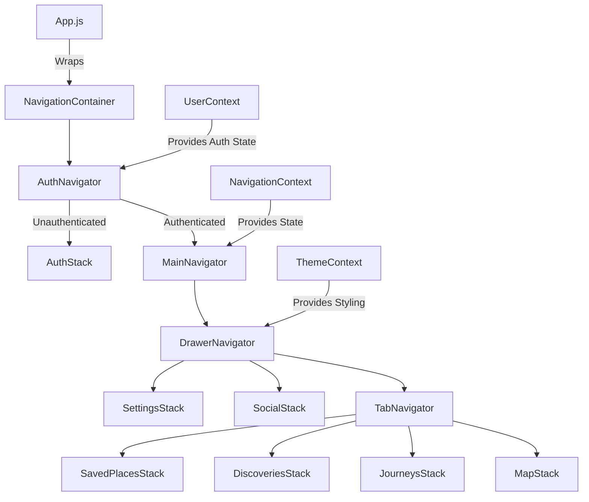

# Design Document: App Navigation

## Overview

The App Navigation feature provides a comprehensive navigation framework for Hero's Path, implementing a hybrid navigation pattern that combines drawer navigation for comprehensive feature access with bottom tab navigation for core functionality. The design emphasizes user experience through smooth transitions, theme integration, and accessibility compliance while maintaining high performance across all supported devices. The navigation system serves as the backbone connecting all major app features including Map Screen, Past Journeys, Discoveries, Saved Places, Social features, and Settings.

## Architecture

The navigation system follows a hierarchical structure with React Navigation v7 as the foundation, implementing a combination of Stack, Drawer, and Tab navigators to provide intuitive user flows. The architecture separates navigation logic from UI components, enabling theme integration and maintaining performance through optimized state management.

### System Context Diagram



The navigation hierarchy ensures proper separation of concerns while maintaining efficient state management and theme integration across all navigation levels.

## Components and Interfaces

### Component 1: NavigationContainer

The root navigation component that wraps the entire navigation tree and provides navigation context to all child components.

```javascript
// navigation/NavigationContainer.js
import React from 'react';
import { NavigationContainer as RNNavigationContainer } from '@react-navigation/native';
import { useTheme } from '../contexts/ThemeContext';
import { AuthNavigator } from './AuthNavigator';

export function NavigationContainer() {
  const { theme, navigationTheme } = useTheme();
  
  return (
    <RNNavigationContainer theme={navigationTheme}>
      <AuthNavigator />
    </RNNavigationContainer>
  );
}
```

#### Key Features:
- Theme integration with React Navigation
- Deep linking configuration
- Navigation state persistence
- Error boundary integration

### Component 2: AuthNavigator

Manages authentication-based navigation routing, determining whether to show authenticated or unauthenticated navigation flows.

```javascript
// navigation/AuthNavigator.js
import React from 'react';
import { createStackNavigator } from '@react-navigation/stack';
import { useUser } from '../contexts/UserContext';
import { MainNavigator } from './MainNavigator';
import { AuthStack } from './AuthStack';
import { LoadingScreen } from '../screens/LoadingScreen';

const Stack = createStackNavigator();

export function AuthNavigator() {
  const { user, isLoading } = useUser();
  
  if (isLoading) {
    return <LoadingScreen />;
  }
  
  return (
    <Stack.Navigator screenOptions={{ headerShown: false }}>
      {user ? (
        <Stack.Screen name="Main" component={MainNavigator} />
      ) : (
        <Stack.Screen name="Auth" component={AuthStack} />
      )}
    </Stack.Navigator>
  );
}
```

#### Key Features:
- Authentication state management
- Conditional navigation rendering
- Loading state handling
- Seamless auth transitions

### Component 3: MainNavigator (Drawer)

Implements the primary drawer navigation for authenticated users, providing access to all major app features.

```javascript
// navigation/MainNavigator.js
import React from 'react';
import { createDrawerNavigator } from '@react-navigation/drawer';
import { TabNavigator } from './TabNavigator';
import { SocialStack } from './stacks/SocialStack';
import { SettingsStack } from './stacks/SettingsStack';
import { CustomDrawerContent } from '../components/navigation/CustomDrawerContent';

const Drawer = createDrawerNavigator();

export function MainNavigator() {
  return (
    <Drawer.Navigator
      drawerContent={(props) => <CustomDrawerContent {...props} />}
      screenOptions={{
        headerShown: false,
        drawerType: 'slide',
        overlayColor: 'rgba(0,0,0,0.5)',
      }}
    >
      <Drawer.Screen 
        name="CoreFeatures" 
        component={TabNavigator}
        options={{ title: 'Hero\'s Path' }}
      />
      <Drawer.Screen 
        name="Social" 
        component={SocialStack}
        options={{ title: 'Social' }}
      />
      <Drawer.Screen 
        name="Settings" 
        component={SettingsStack}
        options={{ title: 'Settings' }}
      />
    </Drawer.Navigator>
  );
}
```

#### Key Features:
- Custom drawer content with user profile
- Theme-aware styling
- Smooth slide animations
- Accessibility support

### Component 4: TabNavigator

Provides bottom tab navigation for core app features, enabling quick switching between primary functions.

```javascript
// navigation/TabNavigator.js
import React from 'react';
import { createBottomTabNavigator } from '@react-navigation/bottom-tabs';
import { Ionicons } from '@expo/vector-icons';
import { useTheme } from '../contexts/ThemeContext';
import { MapStack } from './stacks/MapStack';
import { JourneysStack } from './stacks/JourneysStack';
import { DiscoveriesStack } from './stacks/DiscoveriesStack';
import { SavedPlacesStack } from './stacks/SavedPlacesStack';

const Tab = createBottomTabNavigator();

export function TabNavigator() {
  const { theme } = useTheme();
  
  return (
    <Tab.Navigator
      screenOptions={({ route }) => ({
        tabBarIcon: ({ focused, color, size }) => {
          const iconName = getTabIcon(route.name, focused);
          return <Ionicons name={iconName} size={size} color={color} />;
        },
        tabBarActiveTintColor: theme.colors.primary,
        tabBarInactiveTintColor: theme.colors.textSecondary,
        tabBarStyle: {
          backgroundColor: theme.colors.surface,
          borderTopColor: theme.colors.border,
        },
        headerShown: false,
      })}
    >
      <Tab.Screen 
        name="Map" 
        component={MapStack}
        options={{ title: 'Map' }}
      />
      <Tab.Screen 
        name="Journeys" 
        component={JourneysStack}
        options={{ title: 'Journeys' }}
      />
      <Tab.Screen 
        name="Discoveries" 
        component={DiscoveriesStack}
        options={{ title: 'Discoveries' }}
      />
      <Tab.Screen 
        name="SavedPlaces" 
        component={SavedPlacesStack}
        options={{ title: 'Saved' }}
      />
    </Tab.Navigator>
  );
}
```

#### Key Features:
- Dynamic icon selection
- Theme-integrated styling
- Badge support for notifications
- Accessibility labels

### Component 5: NavigationContext

Provides centralized navigation state management and utility functions for components throughout the app.

```javascript
// contexts/NavigationContext.js
import React, { createContext, useContext, useState, useCallback } from 'react';
import { useNavigation } from '@react-navigation/native';

const NavigationContext = createContext();

export function NavigationProvider({ children }) {
  const navigation = useNavigation();
  const [navigationState, setNavigationState] = useState({
    currentScreen: null,
    previousScreen: null,
    canGoBack: false,
  });
  
  const navigateToScreen = useCallback((screenName, params = {}) => {
    navigation.navigate(screenName, params);
    setNavigationState(prev => ({
      ...prev,
      previousScreen: prev.currentScreen,
      currentScreen: screenName,
    }));
  }, [navigation]);
  
  const goBack = useCallback(() => {
    if (navigation.canGoBack()) {
      navigation.goBack();
    }
  }, [navigation]);
  
  return (
    <NavigationContext.Provider value={{
      navigationState,
      navigateToScreen,
      goBack,
      navigation,
    }}>
      {children}
    </NavigationContext.Provider>
  );
}

export const useNavigationContext = () => {
  const context = useContext(NavigationContext);
  if (!context) {
    throw new Error('useNavigationContext must be used within NavigationProvider');
  }
  return context;
};
```

## Data Models

### NavigationState Model

```javascript
{
  currentScreen: String,           // Current active screen name
  previousScreen: String | null,   // Previous screen for back navigation
  canGoBack: Boolean,             // Whether back navigation is available
  params: Object,                 // Current screen parameters
  routeHistory: Array<String>,    // Navigation history stack
  deepLinkData: Object | null,    // Deep link parameters if applicable
}
```

This model tracks the current navigation state and provides context for navigation decisions and UI updates.

### TabState Model

```javascript
{
  activeTab: String,              // Currently active tab name
  tabBadges: {                   // Badge counts for each tab
    Map: Number,
    Journeys: Number,
    Discoveries: Number,
    SavedPlaces: Number
  },
  tabVisibility: {               // Visibility state for each tab
    Map: Boolean,
    Journeys: Boolean,
    Discoveries: Boolean,
    SavedPlaces: Boolean
  }
}
```

This model manages tab-specific state including active tab, notification badges, and conditional visibility.

### DrawerState Model

```javascript
{
  isOpen: Boolean,               // Whether drawer is currently open
  selectedItem: String,          // Currently selected drawer item
  userProfile: {                 // User information for drawer header
    name: String,
    email: String,
    avatar: String | null,
    memberSince: Date
  },
  menuItems: Array<{            // Available menu items
    name: String,
    icon: String,
    route: String,
    requiresAuth: Boolean,
    badge: Number | null
  }>
}
```

## Error Handling

### Potential Failure Points and Mitigations

1. **Navigation State Corruption**
   - **Detection**: Monitor navigation state changes and validate structure
   - **Mitigation**: Implement state validation and automatic correction
   - **Fallback**: Reset to default navigation state (Map screen)

2. **Deep Link Processing Failures**
   - **Detection**: Catch deep link parsing errors and invalid routes
   - **Mitigation**: Validate deep link format and route existence
   - **Fallback**: Navigate to home screen with error notification

3. **Authentication State Synchronization**
   - **Detection**: Monitor auth state changes and navigation mismatches
   - **Mitigation**: Implement auth state listeners and automatic navigation updates
   - **Fallback**: Force navigation to appropriate auth state

4. **Theme Integration Failures**
   - **Detection**: Monitor theme context availability and styling errors
   - **Mitigation**: Provide default theme fallbacks and error boundaries
   - **Fallback**: Use system default styling until theme is restored

## Testing Strategy

### Unit Tests

Test individual navigation components and utility functions in isolation.

- Test NavigationContext state management
- Test authentication-based navigation logic
- Test theme integration functions
- Test deep link parsing and validation

### Integration Tests

Test navigation flows and component interactions.

- Test complete authentication flow navigation
- Test tab switching and state preservation
- Test drawer navigation and screen transitions
- Test deep link navigation end-to-end

### User Testing

Validate navigation usability and accessibility.

- Test navigation discoverability and intuitiveness
- Test accessibility with screen readers and keyboard navigation
- Test performance on various device types and conditions

## Accessibility Considerations

The navigation system implements comprehensive accessibility support to ensure usability for all users.

1. **Screen Reader Support**
   - Proper semantic labeling for all navigation elements
   - Announcement of navigation state changes
   - Clear focus management during navigation

2. **Keyboard Navigation**
   - Tab order support for all interactive elements
   - Keyboard shortcuts for common navigation actions
   - Focus indicators for keyboard users

3. **Visual Accessibility**
   - High contrast support for navigation elements
   - Scalable text support for navigation labels
   - Color-independent navigation cues

## Performance Considerations

Navigation performance is optimized through several strategies to ensure smooth user experience.

1. **Lazy Loading**
   - Screen components are loaded only when needed
   - Navigation stacks are initialized on demand
   - Heavy components use React.lazy for code splitting

2. **State Optimization**
   - Navigation state updates are batched to prevent excessive re-renders
   - Memoization is used for expensive navigation calculations
   - State persistence is optimized for quick app startup

3. **Animation Performance**
   - Native driver is used for all navigation animations
   - Animation complexity is reduced on lower-end devices
   - Frame rate monitoring ensures 60fps performance

## Implementation Plan

The navigation system will be implemented in phases to ensure stability and proper integration.

1. **Phase 1: Core Navigation Structure**
   - Implement basic navigation container and auth routing
   - Create drawer and tab navigator foundations
   - Set up navigation context and state management

2. **Phase 2: Screen Integration**
   - Integrate existing screens into navigation structure
   - Implement navigation between core features
   - Add theme integration and styling

3. **Phase 3: Advanced Features**
   - Implement deep linking support
   - Add accessibility enhancements
   - Optimize performance and animations

4. **Phase 4: Polish and Testing**
   - Comprehensive testing across all navigation flows
   - Performance optimization and monitoring
   - User testing and feedback integration

## Integration Points

The navigation system integrates with several key app components and contexts.

### Integration with ThemeContext

```javascript
// Example theme integration in navigation
import { useTheme } from '../contexts/ThemeContext';

function ThemedNavigator() {
  const { theme, navigationTheme } = useTheme();
  
  return (
    <NavigationContainer theme={navigationTheme}>
      {/* Navigation structure */}
    </NavigationContainer>
  );
}
```

The navigation system receives theme updates and applies styling changes across all navigation components.

### Integration with UserContext

```javascript
// Example authentication integration
import { useUser } from '../contexts/UserContext';

function AuthAwareNavigator() {
  const { user, isAuthenticated } = useUser();
  
  // Navigation structure adapts based on authentication state
  return isAuthenticated ? <AuthenticatedNav /> : <UnauthenticatedNav />;
}
```

Navigation structure dynamically adapts based on user authentication status and permissions.

## Future Enhancements

The navigation system is designed to support future feature additions and improvements.

1. **Gesture Navigation**: Enhanced gesture support for navigation actions including swipe gestures and custom interactions.

2. **Voice Navigation**: Integration with voice commands for hands-free navigation during activities like walking.

3. **Contextual Navigation**: Smart navigation suggestions based on user behavior, location, and time of day.

4. **Multi-Window Support**: Enhanced navigation for tablet and desktop experiences with multi-window layouts.

5. **Offline Navigation**: Improved offline navigation capabilities with cached screen content and offline-first design.