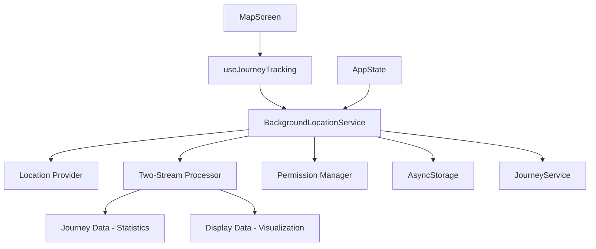

# Design Document: Background Location Tracking

## Overview

The Background Location Tracking feature enables continuous GPS tracking when the app is minimized or the screen is locked. This is a critical feature for Hero's Path as it allows users to record their complete journeys without having to keep the app in the foreground. The design focuses on accuracy, battery efficiency, privacy, and a seamless user experience across both iOS and Android platforms.

This document outlines the technical architecture, components, interfaces, data models, and implementation strategies for the Background Location Tracking feature.

## Architecture

The Background Location Tracking feature follows a **service-centric architecture** with consolidated data processing:



### Core Components

1. **BackgroundLocationService**: **CONSOLIDATED DATA LAYER** - Manages all location functionality including two-stream processing
2. **Two-Stream Processor**: Processes raw GPS into journey data (statistics) and display data (visualization)
3. **Location Provider**: Expo Location API that provides the raw location data
4. **Permission Manager**: Handles requesting and checking location permissions
5. **AsyncStorage**: Stores processed location data during tracking
6. **useJourneyTracking**: **UI STATE LAYER** - Manages journey lifecycle and UI state only
7. **MapScreen**: UI component that displays tracking status and controls
8. **JourneyService**: Handles saving completed journeys with processed data
9. **AppState**: Monitors app lifecycle for background/foreground transitions

### **CRITICAL ARCHITECTURAL CHANGE**
- **Single Source of Truth**: BackgroundLocationService handles ALL data processing
- **No Duplicate Processing**: Eliminated duplicate filtering between service and hook
- **Clear Separation**: Service = Data Processing, Hook = UI State Management

## Dependencies and Extensions

### Dependent Features
- [Journey Tracking](link-to-spec) - Provides journey data for location tracking
- [Search Along Route (SAR)](link-to-spec) - Uses location data for discovery along routes
- [Destination Routing](link-to-spec) - Uses different tracking modes for destination-based navigation
- [Performance Optimization](link-to-spec) - Provides optimization strategies for location tracking
- [Developer Tools](link-to-spec) - Uses location simulation and testing capabilities

### Extension Points
- **Different Modes**: Support for destination-based tracking (Destination Routing)
  - Used by: [Destination Routing](link-to-spec)
  - Implementation: Tracking modes include continuous, destination, and optimized modes

- **Accuracy Tracking**: Enhanced accuracy data for street coverage calculation
  - Used by: [Performance Optimization](link-to-spec), [Search Along Route (SAR)](link-to-spec)
  - Implementation: Location data includes accuracy statistics and street coverage indicators

- **Performance Optimization**: Battery optimization and location smoothing
  - Used by: [Performance Optimization](link-to-spec)
  - Implementation: Adaptive tracking parameters and battery-aware optimization

- **Developer Tools**: Location simulation and testing support
  - Used by: [Developer Tools](link-to-spec)
  - Implementation: Mock location data and simulation capabilities

### Migration Considerations
- Schema version: 1.0
- Migration requirements: Location data structure changes require version tracking
- Backward compatibility: Yes, with migration utilities for legacy data

### Developer Tools Integration
- Testing support: Location simulation and mock tracking data
- Mock data support: Generate test location streams for development
- Simulation capabilities: Simulate various tracking scenarios and conditions

### Performance Optimization
- Caching strategy: Location data cached locally with periodic processing
- Optimization hooks: Adaptive tracking parameters based on conditions
- Performance considerations: Battery optimization and accuracy balancing

## Components and Interfaces

### BackgroundLocationService

The BackgroundLocationService is the core component responsible for managing all location tracking functionality. It provides a clean interface for other components to interact with location tracking features.

#### Public Methods

```javascript
// Initialize the service and check permissions
initialize(): Promise<boolean>

// Start tracking with a specific journey ID
startTracking(journeyId: string, options?: object): Promise<boolean>

// Stop tracking and return processed journey data with both streams
stopTracking(): Promise<{
  coordinates: LocationCoordinates[],      // Journey data for statistics
  displayCoordinates: LocationCoordinates[], // Display data for visualization
  rawCoordinates: LocationCoordinates[],   // Raw data for debugging
  processingStats: ProcessingStats,        // Processing statistics
  id: string,
  endTime: number,
  isActive: boolean
} | null>

// Pause tracking temporarily
pauseTracking(): Promise<void>

// Resume tracking after pause
resumeTracking(): Promise<boolean>

// Get current location once (battery-optimized)
getCurrentLocation(options?: object): Promise<LocationObject>

// Check location permissions
checkPermissions(): Promise<{foreground: boolean, background: boolean}>

// Set callback for location updates
setLocationUpdateCallback(callback: Function): void

// Set callback for journey completion
setJourneyCompleteCallback(callback: Function): void

// Get current tracking status
getStatus(): {isTracking: boolean, currentJourney: JourneyData, hasPermissions: object}

// Clean up resources
cleanup(): void

// NEW: Different tracking modes
setTrackingMode(mode: 'continuous' | 'destination' | 'optimized'): Promise<void>

// NEW: Accuracy tracking
getAccuracyStats(): Promise<AccuracyStats>

// NEW: Developer tools
simulateLocation(coordinates: LocationCoordinates[]): Promise<void>

// NEW: Performance optimization
setOptimizationLevel(level: 'battery' | 'accuracy' | 'balanced'): Promise<void>

// NEW: Get current processed data streams for real-time updates
getCurrentProcessedData(): {
  journeyData: LocationCoordinates[],
  displayData: LocationCoordinates[],
  rawData: LocationCoordinates[],
  processingStats: ProcessingStats | null
}
```

#### Private Methods

```javascript
// Handle location updates with two-stream processing
handleLocationUpdate(location: LocationObject): void

// Process raw GPS data into journey and display streams
processLocationStreams(rawLocations: LocationObject[]): {
  journeyData: LocationCoordinates[],
  displayData: LocationCoordinates[],
  processingStats: ProcessingStats
}

// Validate location coordinates
isValidLocationCoordinates(location: LocationObject): boolean

// Show permission denied alert
showPermissionDeniedAlert(): void

// Open device settings
openDeviceSettings(): void

// Store location data for background processing
storeLocationData(coords: object): Promise<void>

// Get stored location data
getStoredLocationData(): Promise<Array>

// Clear stored location data
clearStoredLocationData(): Promise<void>

// Start GPS warm-up for better accuracy
startGPSWarmup(): Promise<void>

// Complete GPS warm-up
completeGPSWarmup(): void

// Handle app state changes
handleAppStateChange(nextAppState: string): void

// Handle app coming to foreground
handleAppForeground(): void

// Handle app going to background
handleAppBackground(): void

// NEW: Enhanced accuracy tracking
updateAccuracyStats(location: LocationObject): void

// NEW: Street coverage calculation
calculateStreetCoverage(coordinates: LocationCoordinates[]): number

// NEW: Performance monitoring
monitorPerformanceMetrics(): void
```

### MapScreen Integration

The MapScreen component integrates with BackgroundLocationService through useJourneyTracking hook for clean separation of concerns.

```javascript
// SERVICE-CENTRIC ARCHITECTURE: Hook manages UI state, Service processes data
const journeyTracking = useJourneyTracking();
const locationTracking = useLocationTracking(); // Wraps BackgroundLocationService

// Real-time updates from service-processed data
useEffect(() => {
  if (journeyTracking.state.isTracking) {
    // Get processed data from service for UI updates
    journeyTracking.updateFromService(locationTracking);
  }
}, [locationTracking.currentPosition, journeyTracking.state.isTracking]);

// Toggle tracking through hook (which delegates to service)
const toggleTracking = async () => {
  const result = await journeyTracking.toggleTracking(locationTracking, permissions);
  // Hook handles UI state, service handles data processing
};

// NEW: Extension points
const [trackingMode, setTrackingMode] = useState('continuous');
const [optimizationLevel, setOptimizationLevel] = useState('balanced');
const [accuracyStats, setAccuracyStats] = useState(null);
```

### Permission Warning Banner

The MapScreen includes a permission warning banner that appears when background location permissions are not granted:

```javascript
{backgroundPermissionWarning && (
  <TouchableOpacity 
    style={[styles.permissionWarning, { backgroundColor: colors.warning }]} 
    onPress={showBackgroundPermissionWarning}
  >
    <MaterialIcons name="warning" size={20} color={colors.buttonText} />
    <Text style={styles.permissionWarningText}>
      Hero's Path Does Not Have 'Always' Allow Location Access (Tap to resolve)
    </Text>
  </TouchableOpacity>
)}
```

## Data Models

### Location Data

```typescript
interface LocationObject {
  coords: {
    latitude: number;
    longitude: number;
    altitude?: number | null;
    accuracy: number;
    speed?: number | null;
    heading?: number | null;
  };
  timestamp: number;
  
  // NEW: Enhanced accuracy tracking
  accuracyLevel?: 'high' | 'medium' | 'low';
  streetCoverage?: boolean;
  
  // NEW: Performance optimization
  processed?: boolean;
  cacheKey?: string;
  
  // NEW: Migration framework support
  schemaVersion: number;
  lastMigrationAt?: string;
  
  // NEW: Developer tools support
  devMode?: boolean;
  mockData?: boolean;
  
  // NEW: Extension points
  metadata?: Record<string, any>;
  extensions?: Record<string, any>;
}
```

### Journey Data

```typescript
interface JourneyData {
  id: string;
  startTime: number;
  endTime?: number;
  coordinates: Array<{
    latitude: number;
    longitude: number;
    timestamp: number;
    accuracy?: number;
  }>;
  isActive: boolean;
  isPaused?: boolean;
  duration?: number;
  
  // NEW: Migration framework support
  schemaVersion: number;
  lastMigrationAt?: string;
  
  // NEW: Developer tools support
  devMode?: boolean;
  mockData?: boolean;
  
  // NEW: Performance optimization
  lastUpdated: string;
  cacheKey?: string;
  
  // NEW: Extension points
  metadata?: Record<string, any>;
  extensions?: Record<string, any>;
}
```

### Permission Status

```typescript
interface PermissionStatus {
  foreground: boolean;
  background: boolean;
  
  // NEW: Enhanced permission tracking
  lastChecked?: string;
  permissionHistory?: {
    timestamp: string;
    status: 'granted' | 'denied' | 'restricted';
    source: 'user' | 'system' | 'app';
  }[];
}
```

### NEW: AccuracyStats Model

Represents accuracy statistics for location tracking.

```typescript
interface AccuracyStats {
  averageAccuracy: number;
  accuracyDistribution: {
    high: number;
    medium: number;
    low: number;
  };
  streetCoveragePercentage: number;
  totalCoordinates: number;
  filteredCoordinates: number;
  trackingDuration: number;
  batteryImpact: 'low' | 'medium' | 'high';
  
  // NEW: Migration framework support
  schemaVersion: number;
  lastMigrationAt?: string;
  
  // NEW: Developer tools support
  devMode?: boolean;
  mockData?: boolean;
  
  // NEW: Performance optimization
  lastUpdated: string;
  cacheKey?: string;
  
  // NEW: Extension points
  metadata?: Record<string, any>;
  extensions?: Record<string, any>;
}
```

### NEW: TrackingMode Model

Represents different tracking modes for various use cases.

```typescript
interface TrackingMode {
  mode: 'continuous' | 'destination' | 'optimized';
  parameters: {
    timeInterval: number;
    distanceInterval: number;
    accuracy: 'high' | 'medium' | 'low';
    batteryOptimization: boolean;
  };
  destination?: {
    latitude: number;
    longitude: number;
    radius: number;
  };
  
  // NEW: Migration framework support
  schemaVersion: number;
  lastMigrationAt?: string;
  
  // NEW: Developer tools support
  devMode?: boolean;
  mockData?: boolean;
  
  // NEW: Performance optimization
  lastUpdated: string;
  cacheKey?: string;
  
  // NEW: Extension points
  metadata?: Record<string, any>;
  extensions?: Record<string, any>;
}
```

### NEW: MockLocationData Model

Represents mock data for developer tools.

```typescript
interface MockLocationData {
  coordinates: LocationCoordinates[];
  trackingMode: TrackingMode;
  accuracyStats: AccuracyStats;
  mockType: 'test' | 'demo' | 'simulation';
  scenario: 'walking' | 'driving' | 'stationary' | 'erratic';
  
  // NEW: Migration framework support
  schemaVersion: number;
  lastMigrationAt?: string;
  
  // NEW: Developer tools support
  devMode?: boolean;
  mockData?: boolean;
  
  // NEW: Performance optimization
  lastUpdated: string;
  cacheKey?: string;
  
  // NEW: Extension points
  metadata?: Record<string, any>;
  extensions?: Record<string, any>;
}
```

## Error Handling

The Background Location Tracking feature implements comprehensive error handling to ensure robustness:

1. **Permission Denials**: When permissions are denied, the service shows user-friendly alerts with clear instructions on how to enable permissions.

2. **Location Service Failures**: If location services fail, the service attempts to recover and notifies the user if recovery is not possible.

3. **Invalid Coordinates**: The service validates coordinates to prevent issues with invalid data points:

```javascript
isValidLocationCoordinates(location) {
  return location.coords && 
    typeof location.coords.latitude === 'number' && 
    typeof location.coords.longitude === 'number' &&
    !isNaN(location.coords.latitude) && 
    !isNaN(location.coords.longitude) &&
    Math.abs(location.coords.latitude) <= 90 &&
    Math.abs(location.coords.longitude) <= 180;
}
```

4. **GPS Accuracy Issues**: Low-accuracy GPS points are filtered out to improve route quality:

```javascript
isLocationAccurate(location) {
  const accuracy = location.coords.accuracy;
  
  if (accuracy > ACCURACY_THRESHOLDS.REJECT) {
    Logger.debug(`Rejecting location with poor accuracy: ${accuracy}m`);
    return false;
  }
  
  return true;
}
```

5. **App Lifecycle Transitions**: The service handles app lifecycle transitions gracefully to maintain tracking during background/foreground transitions.

## Testing Strategy

The Background Location Tracking feature requires comprehensive testing across different scenarios:

1. **Unit Tests**:
   - Test location filtering and validation functions
   - Test coordinate validation logic
   - Test distance calculation functions
   - Test location smoothing algorithms

2. **Integration Tests**:
   - Test interaction between BackgroundLocationService and MapScreen
   - Test permission flow and UI updates
   - Test journey data storage and retrieval

3. **End-to-End Tests**:
   - Test complete tracking workflow from start to finish
   - Test background/foreground transitions
   - Test permission denial and recovery flows

4. **Platform-Specific Tests**:
   - Test iOS-specific background tracking behavior
   - Test Android-specific foreground service behavior
   - Test permission flows on both platforms

5. **Performance Tests**:
   - Test battery consumption during extended tracking
   - Test memory usage during long journeys
   - Test storage efficiency for large datasets

## Platform-Specific Considerations

### iOS

1. **Background Modes**: Enable the "Location updates" background mode in the app's capabilities.
2. **Permission Requests**: Use `Location.requestBackgroundPermissionsAsync()` with clear purpose strings.
3. **Background Indicators**: Use `showsBackgroundLocationIndicator: true` to show the blue bar when tracking in background.
4. **Activity Type**: Set appropriate `activityType` for better battery performance.

### Android

1. **Foreground Service**: Implement a foreground service with notification for background tracking.
2. **Notification Requirements**: Create a persistent notification with required information.
3. **Permission Flow**: Handle the more complex Android permission model with appropriate dialogs.
4. **Battery Optimization**: Add exemptions from battery optimization for reliable tracking.

## Privacy Considerations

1. **Transparent Communication**: Clearly explain when and why location is tracked.
2. **Minimal Data Collection**: Only collect location data during active walks.
3. **Local Storage**: Store location data locally until explicitly saved by the user.
4. **User Control**: Provide easy access to permission settings and tracking controls.
5. **Clear Indicators**: Show clear visual indicators when tracking is active.

## Implementation Approach

The implementation will follow these steps:

1. Create the BackgroundLocationService class with core functionality.
2. Implement permission handling and UI components.
3. Add location filtering and smoothing algorithms.
4. Implement platform-specific optimizations.
5. Integrate with MapScreen and journey saving workflow.
6. Add error handling and recovery mechanisms.
7. Optimize for battery performance.
8. Add comprehensive logging for debugging.

## Known Limitations and Future Improvements

1. **Battery Optimization**: Further optimize battery usage based on movement patterns.
2. **Offline Support**: Enhance support for tracking without network connectivity.
3. **Adaptive Accuracy**: Dynamically adjust accuracy based on battery level and movement speed.
4. **Enhanced Filtering**: Implement more sophisticated filtering algorithms for better route quality.
5. **Geofencing Integration**: Add support for geofencing to enhance location-based features.
6. **Fix for Minimum Distance Modal**: Address the known issue where the minimum distance modal is not triggered when ending a walk without moving.